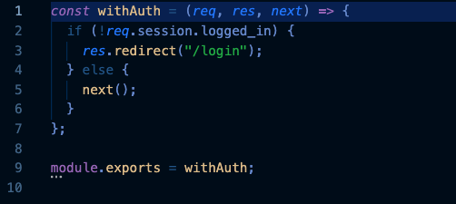

# Community Garden 🌿
For the plant lover to the new plant parent, this application has taken on the responsibility to connect those who wish to expand their plant collections and community. The application may save one more plant from being canned, and the opportunity to make a new friend (green 🌱 or human 👩🏻‍🌾 ) by providing a community space for plants and plant enthusiasts alike. 

## 🌱 Our Application:  
    Once logged in, the user is introduced to a few uses of our application; adopt, post, and easy care. 

### Login Page

### Home Page

    Regardless the reason, if a plant is in need of a new home the app provides the link 'post', which then transfers the user to a form where they fill out descriptors of the plant they are placing up for adoption.  

### Create a Post

    Once posted, those who are looking to add to their collection may visit the adopt page to scroll through various home seekers. 

### Adopt

    Now, we haven't forgotton about those of us who are looking for a beginners plant, and for that you may look under 'easy care'. There the user will find what plants were rated easiest and friendliest to care for.

### Easy Care

## 🌱 Construction:
As a team, it was decided to split into two groups, the front-end and backend.

The front-end was resposible for UI/UX and how approachable, visually attractive, and user friendly the application was to be displayed on screen. All the while, helping with the addition of handlebars. 

The back-end was responsible for the database, the functionality of the forms and storing any user input from those forms to the database.  

## 🌱 What We Learned:

One of the greater challenges for the frontend team was the use for the handlebars and how to replace prior knowledge of HTML file usage with them. To the point where an HTML page file was unnecessary. Luckily, the trick was as easy as links copied and pasted in the main.handlebars file.  

For the backend team, a challenge that was presented was the functionality of the login button. 

So, when a user visits our application they are first presented with a login page, then they are either instructed to enter their user and password or to create a new profile. 

Once they've completed those tasks if they click login or create, the user is transported to the home page of Community Garden. The link between the homepage and the login page was an opposition for the team, that is until it was noticed that
the log in button requires you set up a session that will will track you form login to log out. 

Then, set up middleware to check the logged in status of that session. The application of the middleware can be found in the home routes before the "ascyn" you will find "withauth" that is the middle ware being called and later you see logged_in: req.session.logged_in. The middleware can be found in the utils folder. 

Thus, here is what the thing it is looking for to confirim, and now we have a functional login button that guides the user to the homepage and authenticates them as a user.

## 🌱 Future Additions:
At the start of this project, the team had a handful of ideas to implement for the website that time did not allow for us.

So, for future additions to the application, it was had in mind to give the user the option to upload an image of the plant they are trying to post for adoption.

Ontop of that, a delete button for those who have posted, who no longer a need to find a new home or keep their plant friend posted, because their has been an adoption or they had a change of heart. 

Moving forward, the construction of an interactive blogging page where users may communicate with fellow plant lovers about plant health care, maintenance, or even plan community events is still in the back of our heads.

With that in mind, the team is looking forward for the Community Garden application to have its debute as a user and plant friendly platform and guide.

## 🌱 Links 🌱

Heroku:

https://community-gardens-2021.herokuapp.com/